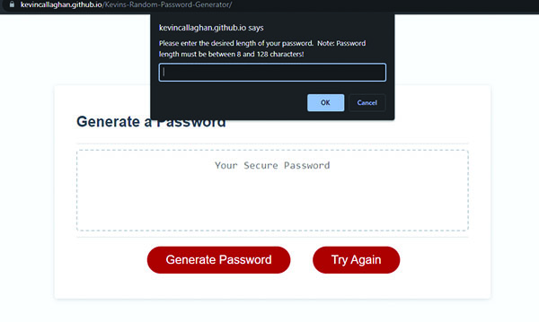

# Kevin's Random Password Generator

## Description

This project is a random password generator designed to get input from the user and then provide them with a randomly generated password that meets the user's input criteria.  It will give the user the option of uppercase letters, lowercase letters, numbers, and special characters, and also allow the user to set the password length between 8 and 128 characters.  There are validations in place to ensure all inputs are acceptable throughout the user's input process.  During this project I learned a lot about javascript variables, operators, for loops, while loops, and some of the built in functions such as push and join.  I also got a better understanding of using an event listener to execute a command.

## Table of Contents

- [Usage](#usage)
- [Credits](#credits)
- [License](#license)

## Usage

Link to deployed page: https://kevincallaghan.github.io/Kevins-Random-Password-Generator/ 

To use this program, visit the link above and:

1. Enter the desired password length, between 8 and 128 characters.
2. Select Y or N if you would like to include uppercase letters in your password.
3. Select Y or N if you would like to include lowercase letters in your password.
4. Select Y or N if you would like to include numbers in your password.
5. Select Y or N if you would like to include special characters in your password.
6. Once you receive the 'Thank You' message, click the "Generate Password" button to view your new randomly generated password.
7. Click 'Try Again' to reload the page and create a new password

Preview of initial page:

  

## Credits

1. To learn how to validate my variable inputs for character type, I found a question on Stack Overflow that was very similar to the question I had regarding validation, and in the answers I found logic that was able to solve the problem I was having with requiring only Y or N inputs, and requiring at least one Y input.  The question/answer can be found here: https://stackoverflow.com/questions/48410637/can-i-use-a-while-loop-to-validate-a-prompt-input 

2. To learn how to pick a random item from my array, I found the information on css-tricks.com in an article titled, "Select Random Item from an Array" by Chris Coyier (2016).  He had a line of code that I used to create my random character.  The article can be found here: https://css-tricks.com/snippets/javascript/select-random-item-array/ 

3. I found the correct usage of push(); to add my random character to the passwordInProgress= []; array in an article on freedocecamp.org by Joel Olawanle (2022).  The article can be found here: https://www.freecodecamp.org/news/how-to-insert-an-element-into-an-array-in-javascript/ 

4. I found the correct usage of push(); to merge two arrays together on developer.mozilla.org.  I am using this to combine the character sets chosen by the user so I can randomly pull from and complete my password.  The article can be found here: https://developer.mozilla.org/en-US/docs/Web/JavaScript/Reference/Global_Objects/Array/push 

## License

Please refer to the LICENSE document in the repository for License information.
